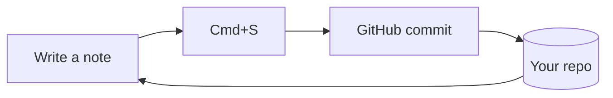

# Welcome to your personal folder

This note lives at `vault/Welcome.md` in your own GitHub repo. Everything you do
here — writing, pasting, uploading, renaming, deleting — becomes a real commit.
No database, no server, no third party. Just your repo.

## The three-second version

1. Hit **New note**, paste your markdown, press <kbd>Cmd</kbd>+<kbd>S</kbd>.
2. Drag files anywhere on the window to upload them into the current folder.
3. Paste an image straight into the editor — it uploads and links itself.

> [!TIP]
> Press <kbd>Cmd</kbd>+<kbd>K</kbd> to jump to any note by name. Type `>` for
> commands, or `#tag` to find notes by their frontmatter tags.

## Every block renders properly

### Task lists that write back

Tick a box in the preview and the markdown source updates and commits itself.

- [x] Set up the vault
- [ ] Move my old notes in
- [ ] Stop paying for a notes app

### Code, with the language called out

```js
// Copy and soft-wrap buttons live in the header of every code block.
async function save(path, text) {
  const res = await GH.putFile(path, U.b64encode(text), sha, 'Update ' + path);
  return res.content.sha;
}
```

```python
def tidy(rows):
    """Syntax highlighting covers ~40 common languages."""
    return sorted(r for r in rows if r.strip())
```

### Tables that scroll instead of squashing the page

| Action | Shortcut | What lands in git |
| --- | --- | :---: |
| Save note | `Cmd+S` | One commit |
| Upload files | `Cmd+Shift+U` | One commit for the batch |
| Rename | — | One commit (move, not copy) |
| Delete | — | One commit, history preserved |

### Callouts

> [!NOTE]
> Standard GitHub alert syntax is supported: NOTE, TIP, IMPORTANT, WARNING and CAUTION.

> [!WARNING]
> Your access token is stored in this browser only. Sign out on shared machines.

### Quotes, rules and the rest

> A plain blockquote still looks like a plain blockquote.
> — you, later

Inline bits work too: **bold**, *italic*, ~~struck through~~, `inline code`,
[an external link](https://github.com), and footnote-style references.

---

### Diagrams



## Where things live

- `vault/` — everything you create. Folders are yours to organise.
- `vault/assets/` — where pasted and dropped images land by default.
- `index.html`, `assets/` — the app itself. Leave these alone and it keeps working.

## Frontmatter is optional

The `---` block at the top of this file becomes the chips under the title.
Use `tags:` and they become clickable filters. Skip it entirely if you'd rather
just write.
